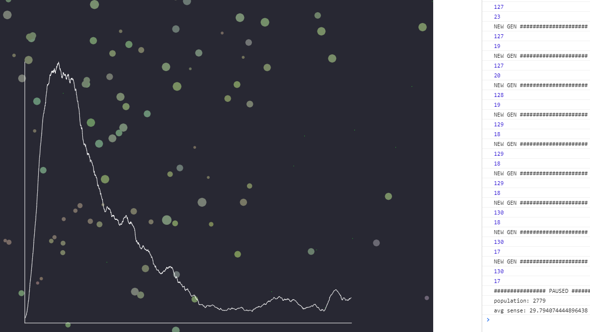

# Simulating Natural Selection
 
###### Using mutations to drive evolution in an agent based ecosystem

_Above: a stable population of 130 after 2,700 generations_

Simulating a complex process such as natural selection can be relatively simple to compute, with very few rules and a completely passive role in the evolution.

Each animal moves around their environment in search of food. If food is within their sense radius, the animal moves directly towards it; otherwise, they moves randomly. Every time step, they lose some of their health. If they can find and eat food, they prolong their life and replication chances. However, if their health drops to zero they die and become food themselves.

Each animal also has a chance to replicate every time step, provided the animal is healthy enough. If an animal reproduces, the offspring inherit its parents traits: speed, size, color, and sense; however, these traits are slightly mutated during replication to give rise to new, genetically distinct species.

After many trials, it seems that the succesful populations tend to stabilize around one set of characteristics. Populations that continue to evolve often go through too many population booms and busts to survive in the long term.

Future plans are to create more quantitative data collections and visualizations with different parameters and ecosystems.